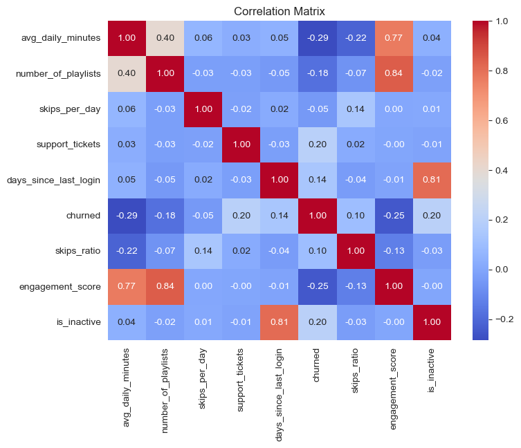
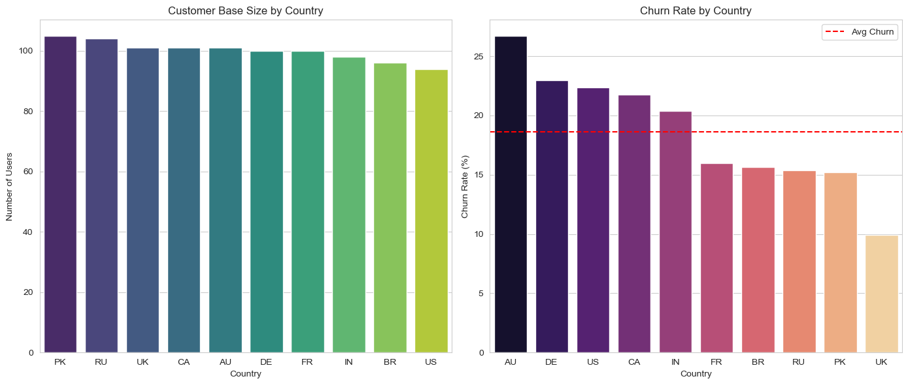
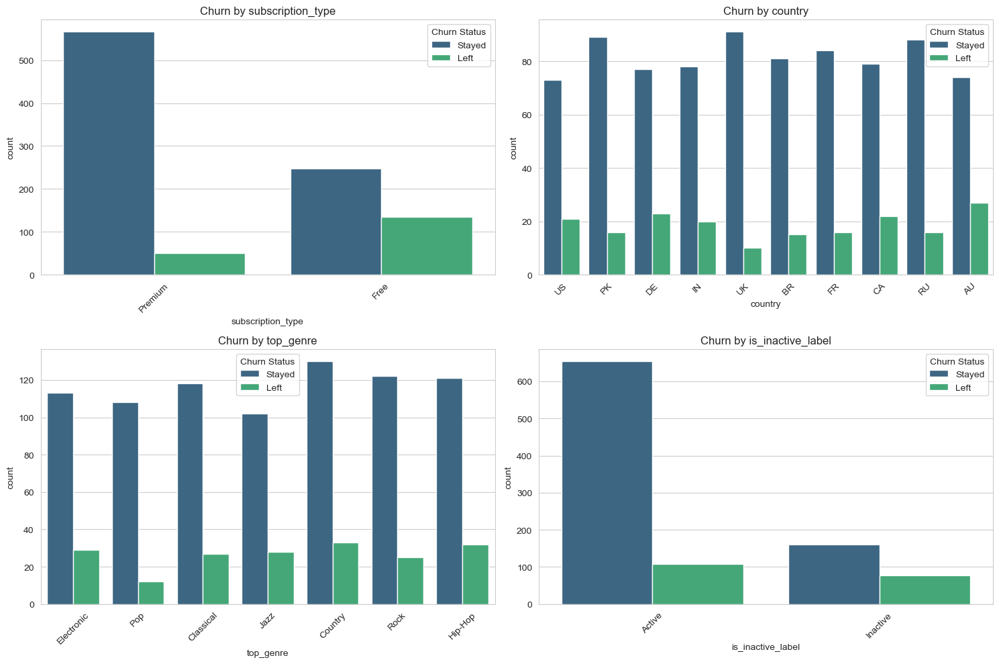
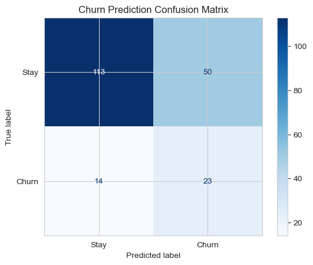

# 🎵 Spotify Churn Prediction System


## 📌 Project Overview
Customer Churn (users cancelling subscriptions) is a critical metric for streaming services. This project builds an end-to-end Machine Learning pipeline to **predict which users are likely to cancel**, allowing the business to intervene with retention offers.

The system handles severe **Class Imbalance** (80% stay / 20% leave) and utilizes a custom preprocessing pipeline with intensive **Feature Engineering**.

## 📊 Key Results Summary
| Model | Accuracy | Churn Recall (Safety) | Churn Precision (Trust) | Verdict |
| :--- | :--- | :--- | :--- | :--- |
| **Baseline (Guessing)** | 81% | 0% | 0% | Useless |
| **Logistic Regression (Balanced)** | **68%** | **62%** | **32%** | **Deployed** |

> **Business Impact:** While the model generates some false alarms (Precision 32%), it successfully identifies **62% of at-risk users** who were previously invisible. We prioritized **Recall** to maximize retention opportunities.

---

## 📈 Exploratory Data Analysis (EDA)
Before modeling, we investigated the dataset to understand key relationships and distributions.

### 1. Feature Correlations
An analysis of how numerical features correlate with each other and the target variable (`is_churned`).


### 2. Numerical Feature Distributions
Visualizing the spread of key numerical behaviors like daily listening minutes and skip behavior.


### 3. Categorical & Geographic Analysis
Investigating how churn behaves across different regions and subscription tiers.

*Categorical feature breakdown:*


---

## 🛠️ The Pipeline

### 1. Data Cleaning & Engineering
- **String Sanitization:** Fixed hidden whitespace bugs in categorical columns (e.g., `' India '` → `'India'`).
- **Feature Engineering:**
    - `skips_ratio`: Calculated `skips_per_day / avg_daily_minutes` to measure user frustration.
    - `engagement_score`: A weighted index of login frequency and listening time.
    - `is_inactive`: Flagged users with >14 days since last login.

### 2. Preprocessing Architecture (`ColumnTransformer`)
We used a split-pipeline approach to handle mixed data types safely:
- **Numerical:** Imputation (Median) → Standard Scaling (`StandardScaler`).
- **Categorical:** One-Hot Encoding (`drop='first'` to avoid multicollinearity).
- **Binary Flags:** Passthrough (preserved `0`/`1` logic without scaling).

### 3. Modeling
- Addressed imbalance using `class_weight='balanced'` in Logistic Regression.

---

## 📊 Model Evaluation

### Confusion Matrix
The confusion matrix visualizes the performance of the deployed model on the test set. Given the imbalanced data, we focus heavily on the **True Positives (Bottom Right)**—the churners we successfully caught—versus the **False Negatives (Bottom Left)**—the churners we missed.



---

### Detailed Classification Report
The detailed breakdown of Precision, Recall, and F1-Score for each class (0 = Retained, 1 = Churned).

```text
              precision    recall  f1-score   support

           0       0.89      0.69      0.78       163
           1       0.32      0.62      0.42        37

    accuracy                           0.68       200
   macro avg       0.60      0.66      0.60       200
weighted avg       0.78      0.68      0.71       200
```

## 📂 Project Structure
```bash
Spotify-Customer-Churn/
├── EDA/                    # Exploratory Data Analysis graphs
│   ├── cat_cols.png
│   ├── correlation_matrix.png
│   ├── country_wise.png
│   └── num_cols.png
├── results/                # Model evaluation metrics/graphs
│   └── cm.png
├── data.csv                # Raw data (often gitignored in real projects)
├── X_processed.csv         # Processed features placeholder
├── main.ipynb              # Main workflow notebook
├── old_main.ipynb          # Previous versions
├── README.md               # Project Documentation
└── .gitignore              # Git exclusion rules
