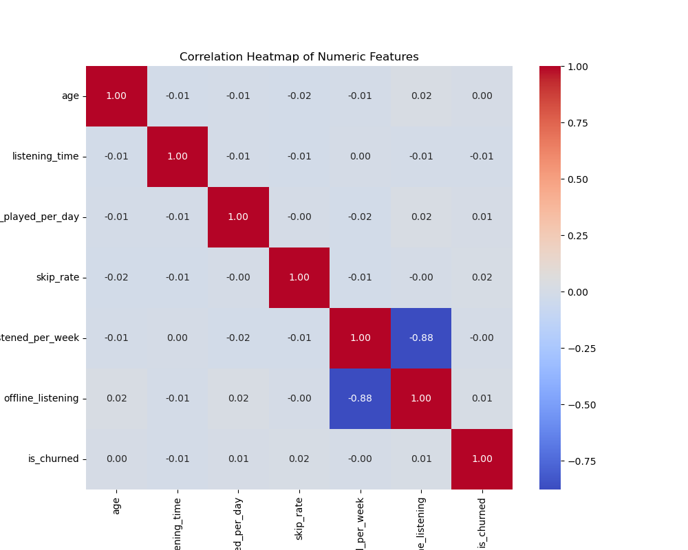
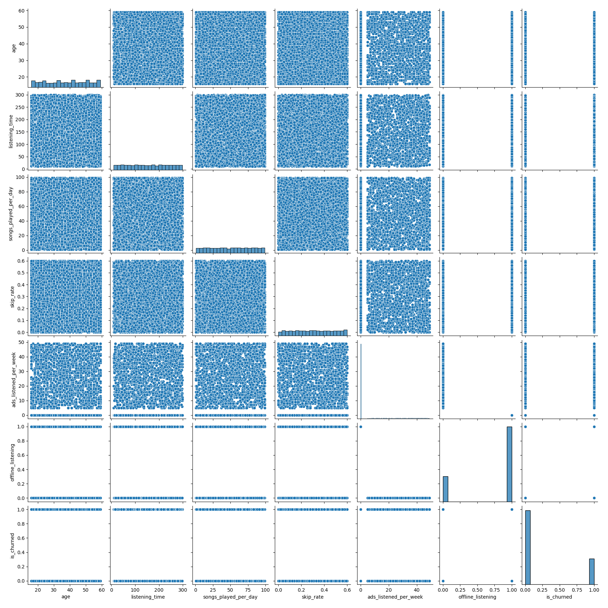

# 🎵 Spotify Churn Prediction System


## 📌 Project Overview
Customer Churn (users cancelling subscriptions) is a critical metric for streaming services. This project builds an end-to-end Machine Learning pipeline to **predict which users are likely to cancel**, allowing the business to intervene with retention offers.

The system handles severe **Class Imbalance** (80% stay / 20% leave) and utilizes a custom preprocessing pipeline with **Feature Engineering**.

## 📊 Key Results
| Model | Accuracy | Churn Recall (Safety) | Churn Precision (Trust) | Verdict |
| :--- | :--- | :--- | :--- | :--- |
| **Baseline (Guessing)** | 81% | 0% | 0% | Useless |
| **Logistic Regression (Balanced)** | **68%** | **62%** | **32%** | **Deployed** |

> **Business Impact:** While the model generates some false alarms (Precision 32%), it successfully identifies **62% of at-risk users** who were previously invisible. We prioritized **Recall** to maximize retention opportunities.

## 🛠️ The Pipeline

### 1. Data Cleaning & Engineering (`01_EDA_and_Cleaning`)
- **String Sanitization:** Fixed hidden whitespace bugs in categorical columns (e.g., `' India '` → `'India'`).
- **Feature Engineering:**
    - `skips_ratio`: Calculated `skips_per_day / avg_daily_minutes` to measure user frustration.
    - `engagement_score`: A weighted index of login frequency and listening time.
    - `is_inactive`: Flagged users with >14 days since last login.

### 2. Preprocessing Architecture (`ColumnTransformer`)
We used a split-pipeline approach to handle mixed data types safely:
- **Numerical:** Imputation (Median) → Standard Scaling (`StandardScaler`).
- **Categorical:** One-Hot Encoding (`drop='first'` to avoid multicollinearity).
- **Binary Flags:** Passthrough (preserved `0`/`1` logic without scaling).

### 3. Modeling
- Addressed imbalance using `class_weight='balanced'`.
- Tuned the **Decision Threshold** from 0.50 to 0.75 to reduce false positives.

## 📈 Visualizations
### Correlation Heatmap
*Analysis of feature relationships and multicollinearity.*


### Numerical Pairplot
*Distribution of daily minutes vs. skips for churned vs. retained users.*


## 📂 Project Structure
```bash
Spotify-Customer-Churn/
├── data/                   # Raw and Processed Data (Ignored by Git)
├── notebooks/
│   ├── 01_EDA_Cleaning.ipynb    # Data Janitor work
│   ├── 02_Classical_Models.ipynb # Logistic Regression & XGBoost
│   └── 03_Deep_Learning.ipynb    # PyTorch Implementation (In Progress)
├── plots/                  # Generated PNGs
├── README.md               # Project Documentation
└── requirements.txt        # Dependencies